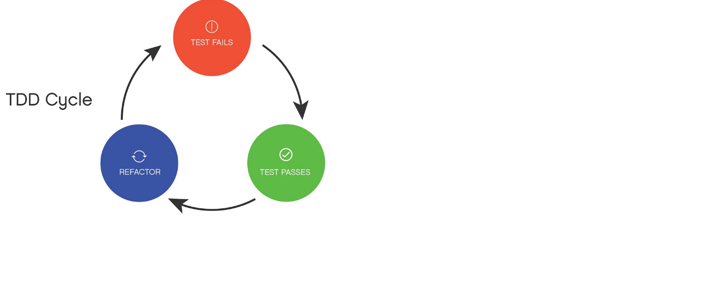

**TDD Task**
- Create a new Repo on gihub
- Create a new project in pycharm
- name tdd_test_task
- create a TDD diagram
- create a file to write tests (multi_test.py)
- create a file to write code (multicheck.py)
- implement sudo coding
- create a README to document the steps to successfully achieve the task

- create a test to check is the number divisible/remainder 0 if True pass the test if False fail
-  create a test case to calculate % and code to pass the test
- create a test to check if the given values are positive 

 
```python
# create a test to validate the methods from RemainderCheck class
import unittest
import pytest

from multicheck import MultiCheck


class Multi_test(unittest.TestCase):
    #create an object of the class RemainderCheck to test
    div = MultiCheck()
    # assertions to write our test cases
    def test_divisible(self):
        self.assertEqual(self.div.remainder(6, 3), 0)
        
    #assertions to validate the perrcentage method
    def test_percent(self):
        self.assertEqual(self.div.percentage(10, 5), 50)
        
    #assertions to validate positivity method
    def test_positive(self):
        self.assertEqual(self.div.positivity(5), True)

```
- create a class and method to write code to pass the test
- create a method in the class to pass the test

```python
# create a test to validate the methods from RemainderCheck class
import unittest
import pytest

from multicheck import MultiCheck


class Divisibletest(unittest.TestCase):
    #create an object of the class RemainderCheck to test
    div = MultiCheck()
    # assertions to write our test cases
    def test_divisible(self):
        self.assertEqual(self.div.remainder(6, 3), 0)
        
    #assertions to validate the perrcentage method
    def test_percent(self):
        self.assertEqual(self.div.percentage(10, 5), 50)
        
    #assertions to validate positivity method
    def test_positive(self):
        self.assertEqual(self.div.positivity(5), True)

```
